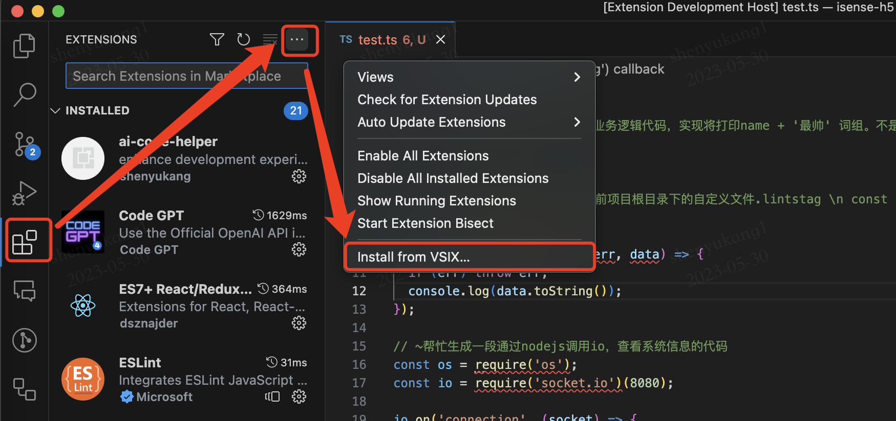
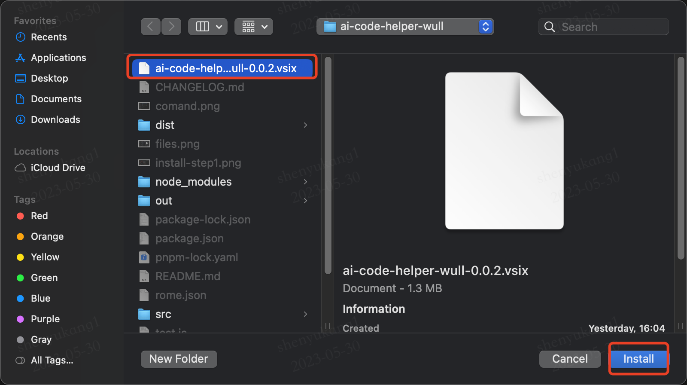
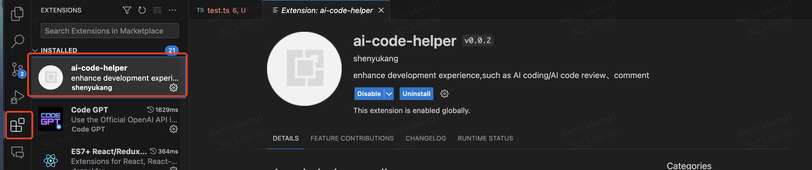
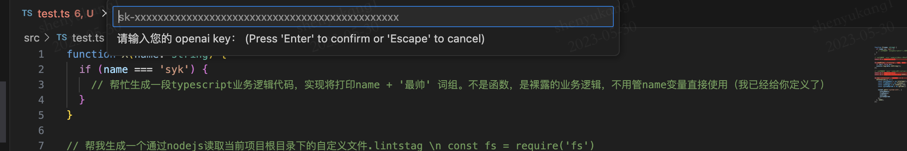
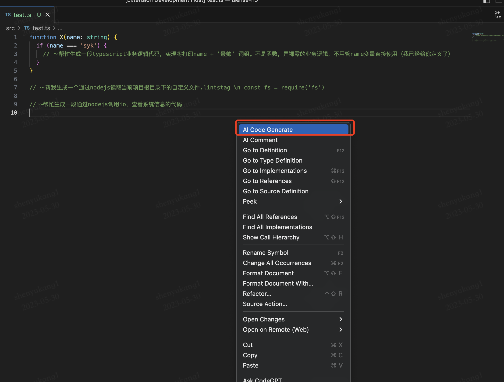
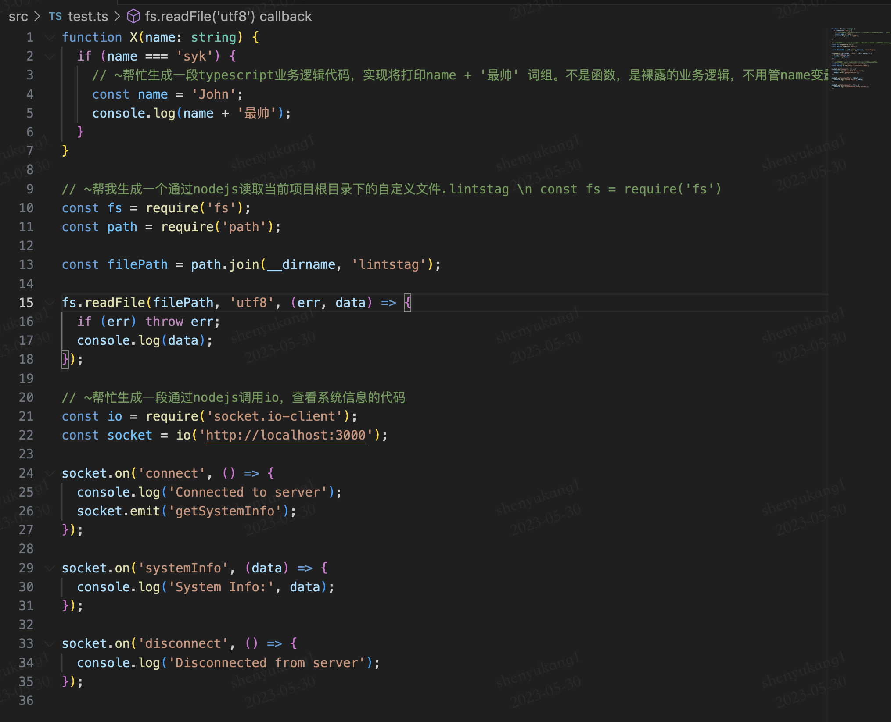

# ai code helper wull
欢迎来到ai code helper，当使用当前插件时，你需要先获取openai key，

## Step
### 1. 安装
   通过vsix安装文件来安装，安装步骤如下 







### 2. 使用

#### 2.1 初始化
Mac OS系统中使用`command shift p`快捷键 调出vscode command input框.（Windows自行查阅快捷键）。
接下来可以输入 WullCopilot，会联想出WullCopilot相关的命令，选择Hello WullCopilot初始化插件（只需安装后第一次需要，后面不用）


#### 2.2 设置openai key
同样的如上图，选择UPDATE Key 命令，会调出如下图的顶部输入框，然后将你的openai key复制进来回车即可！




#### 2.3 如何使用

特定注释 & 右键菜单选择AI Code Generate功能

>  特定注释

例如
``` javascript
function X(name: string) {
  if (name === 'syk') {
    // ~帮忙生成一段typescript业务逻辑代码，实现将打印name + '最帅' 词组。不是函数，是裸露的业务逻辑，不用管name变量直接使用（我已经给你定义了）
undefined

  }
}

// ~帮我生成一个通过nodejs读取当前项目根目录下的自定义文件.lintstag \n const fs = require('fs')
const fs = require('fs');
const path = require('path');

const lintstagPath = path.join(process.cwd(), 'lintstag');

fs.readFile(lintstagPath, 'utf8', (err, data) => {
  if (err) {
    console.error(err);
    return;
  }

  console.log(`Content of ${lintstagPath}:`);
  console.log(data);
});


// ~帮忙生成一段通过nodejs调用io，查看系统信息的代码
const os = require('os');

const cpuPercent = () => {
  return new Promise((resolve, reject) => {
    const startTime = Date.now();
    let startUsage = null;

    setTimeout(() => {
      const endTime = Date.now();
      const endUsage = process.cpuUsage();

      if (startUsage && startTime) {
        const elaspedTime = (endTime - startTime) / 1000;
        const elaspedUsage = endUsage.user - startUsage.user;
        const cpuPercent = 100 * elaspedUsage / 1000000 / elaspedTime;

        resolve(cpuPercent.toFixed(1));
      } else {
        reject('Error getting CPU usage');
      }
    }, 1000);

    startUsage = process.cpuUsage();
  });
}

const memUsage = () => {
  const totalMemory = os.totalmem();
  const freeMemory = os.freemem();
  const usedMemory = totalMemory - freeMemory;

  return {
    total: `${(totalMemory / (1024 ** 2)).toFixed(2)} MB`,
    used: `${(usedMemory / (1024 ** 2)).toFixed(2)} MB`,
    free: `${(freeMemory / (1024 ** 2)).toFixed(2)} MB`
  }
}

const systemInfo = async () => {
  const cpu = await cpuPercent();
  const memory = memUsage();
  const uptime = process.uptime().toFixed(0);
  const hostname = os.hostname();
  const osType = os.type();
  const osRelease = os.release();

  console.log(`\n\nCPU Usage: ${cpu}%`);
  console.log(`Memory Usage: ${memory.used} / ${memory.total}`);
  console.log(`Free Memory: ${memory.free}`);
  console.log(`Uptime: ${uptime} seconds`);
  console.log(`Hostname: ${hostname}`);
  console.log(`System Type: ${osType}`);
  console.log(`System Release: ${osRelease}\n\n`);
}

(async () => {
  await systemInfo();
})();

```


规律是 `// ~`开头的行注释可被视为ai code generate prompt，上面代码会分别生成三块儿代码，然后自动插入到对应注释的下一行。
# ai code generate prompt

# Generate a list of even numbers from 0 to 10 using a for loop
even_numbers = []
for num in range(0, 11):
    if num % 2 == 0:
        even_numbers.append(num)

# Print the list of even numbers
print(even_numbers)

# Generate a dictionary containing information about a person
person = {'name': 'John', 'age': 25, 'city': 'New York'}

# Access and print the value of the 'name' key in the dictionary
print(person['name'])

# Add a new key-value pair to the dictionary
person['occupation'] = 'Engineer'

# Print the updated dictionary
print(person)


> 右键生成功能


生成的demo结果
