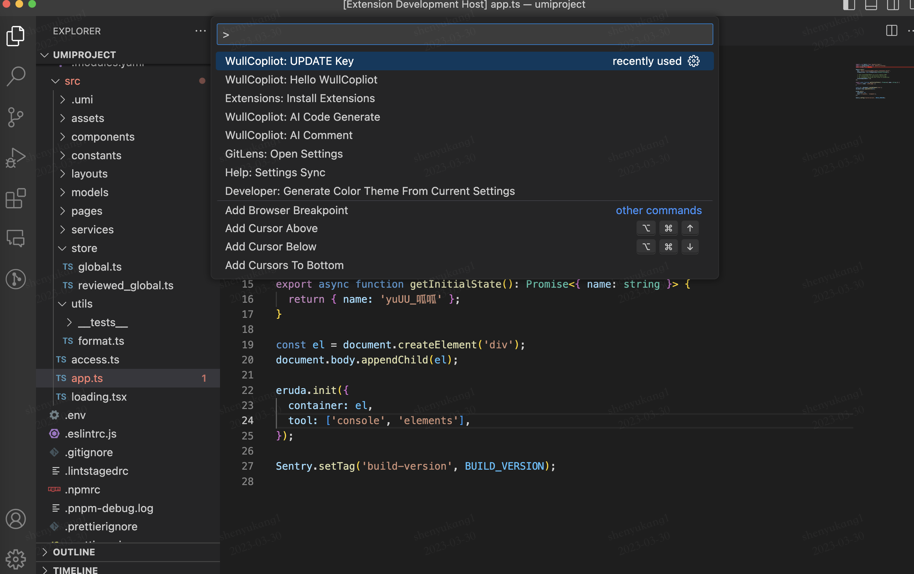

# ai code helper wull
欢迎来到ai code helper，当使用当前插件时，你需要先获取openai key，

## Step
### 1. 安装
   通过vsix安装文件来安装，安装步骤如下 


### 2. 使用

#### 2.1 初始化
Mac OS系统中使用`command shift p`快捷键 调出vscode command input框.（Windows自行查阅快捷键）。
接下来可以输入 WullCopilot，会联想出WullCopilot相关的命令，选择Hello WullCopilot初始化插件（只需安装后第一次需要，后面不用）



#### 2.2 设置openai key
同样的如上图，选择UPDATE Key 命令，会调出如下图的顶部输入框，然后将你的openai key复制进来回车即可！


#### 2.3 如何使用

特定注释 & 右键菜单选择AI Code Generate功能

- 特定注释

例如
``` javascript
function X(name: string) {
  if (name === 'syk') {
    // ~帮忙生成一段typescript业务逻辑代码，实现将打印name + '最帅' 词组。不是函数，是裸露的业务逻辑，不用管name变量直接使用（我已经给你定义了）
  }
}

// ~帮我生成一个通过nodejs读取当前项目根目录下的自定义文件.lintstag \n const fs = require('fs')


// ~帮忙生成一段通过nodejs调用io，查看系统信息的代码
```

规律是 `// ~`开头的行注释可被视为ai code generate prompt，上面代码会分别生成三块儿代码，然后自动插入到对应注释的下一行。

- 右键生成功能


生成的demo效果

